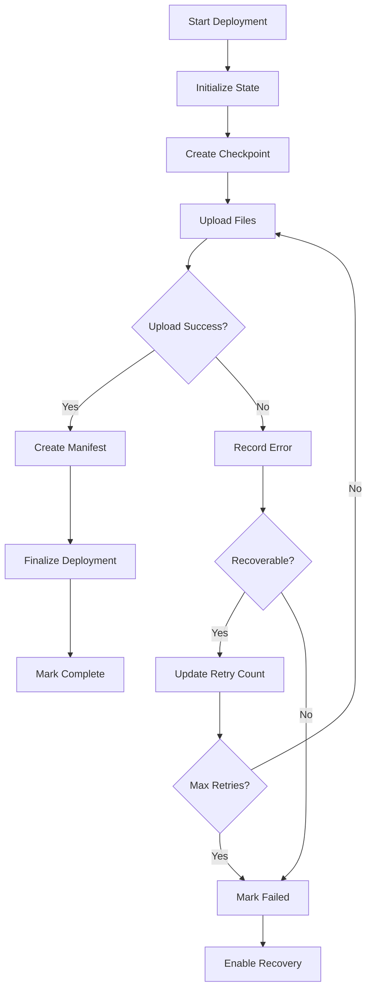

# Walrus Sites Deployment Recovery System

A comprehensive deployment recovery system for Walrus Sites deployments that handles failures gracefully and provides robust recovery mechanisms.

## Overview

The Walrus Sites Deployment Recovery System provides:

- **Automatic State Tracking**: Every deployment is tracked with detailed state information
- **Checkpointing**: Regular snapshots allow resuming from specific points
- **Failure Recovery**: Intelligent recovery from network, storage, and blockchain failures
- **Rollback Capability**: Quick rollback to previous working versions
- **Progress Monitoring**: Real-time deployment progress tracking
- **Resource Cleanup**: Automatic cleanup of failed deployments

## Architecture

### Core Components

1. **DeploymentRecoveryManager**: Central state management and recovery coordination
2. **WalrusSitesDeploymentService**: Main deployment orchestration with recovery integration
3. **DeploymentMonitor**: Real-time monitoring and alerting system
4. **CLI Command**: User-friendly interface for all deployment operations

### Recovery Flow



## Features

### 1. Deployment State Management

Each deployment maintains comprehensive state:

```typescript
interface DeploymentState {
  id: string;
  status: 'pending' | 'uploading' | 'processing' | 'failed' | 'completed';
  siteName: string;
  network: 'testnet' | 'mainnet';
  progress: {
    totalFiles: number;
    uploadedFiles: number;
    failedFiles: string[];
    completedFiles: string[];
  };
  walrusOperations: {
    uploads: UploadOperation[];
    transactions: TransactionOperation[];
  };
  recovery: {
    canResume: boolean;
    lastCheckpoint: string;
    rollbackAvailable: boolean;
  };
  errors: ErrorRecord[];
}
```

### 2. Failure Recovery Scenarios

#### Network Interruptions
- Automatic detection of network timeouts
- Retry mechanism with exponential backoff
- Resume from last successful upload

#### Partial File Uploads
- Track individual file upload status
- Validate existing uploads before retry
- Skip already uploaded files on resume

#### Blockchain Transaction Failures
- Retry failed transactions with new gas estimates
- Handle transaction timeout scenarios
- Rollback capability for failed deployments

#### Configuration Errors
- Validate deployment configuration before starting
- Provide clear error messages for fixes
- Skip validation on resume if previously validated

### 3. Checkpointing System

Regular checkpoints are created during deployment:

- **Initialization**: Before starting uploads
- **Upload Progress**: After every 10% of files uploaded
- **Manifest Creation**: Before creating site manifest
- **Finalization**: Before final blockchain operations

Checkpoints include:
- Current deployment state
- List of completed uploads with blob IDs
- Pending operations
- Error history

### 4. Rollback Functionality

For deployments with previous versions:

- Store reference to previous site version
- Quick rollback to last working state
- Automatic cleanup of failed deployment artifacts
- Preserve previous version until new deployment succeeds

## Usage

### Basic Deployment

```bash
# Deploy with recovery enabled (default)
waltodo deploy-site out/ --site-name my-app --network testnet

# Enhanced deployment script
./scripts/deploy-walrus-site-enhanced.sh --site-name my-app --network testnet
```

### Recovery Operations

```bash
# List all deployments
waltodo deploy-site --list-deployments

# Resume failed deployment
waltodo deploy-site --resume deploy_1640995200000_a1b2

# Check deployment status
waltodo deploy-site --deployment-status deploy_1640995200000_a1b2

# Rollback deployment
waltodo deploy-site --rollback deploy_1640995200000_a1b2

# Cancel active deployment
waltodo deploy-site --cancel deploy_1640995200000_a1b2

# Clean up old deployments
waltodo deploy-site --cleanup-old 7
```

### Monitoring

```bash
# Monitor deployment progress
./scripts/deploy-walrus-site-enhanced.sh --monitor --status deploy_1640995200000_a1b2

# Real-time progress tracking
waltodo deploy-site out/ --site-name my-app --progress --verbose
```

## Configuration

### Recovery Options

```typescript
interface RecoveryOptions {
  maxRetries: number;        // Default: 3
  retryDelay: number;        // Default: 5000ms
  timeoutMs: number;         // Default: 300000ms (5 minutes)
  cleanupOnFailure: boolean; // Default: true
  enableRollback: boolean;   // Default: true
  preservePartialUploads: boolean; // Default: true
}
```

### Environment Variables

```bash
# WalTodo CLI path (if not in PATH)
export WALTODO_CLI_PATH=/path/to/waltodo

# Walrus configuration
export WALRUS_CONFIG_PATH=/path/to/walrus/config.yaml
export WALRUS_WALLET_PATH=/path/to/wallet.yaml

# Site builder
export SITE_BUILDER_PATH=/path/to/site-builder
```

## Error Handling

### Error Types

1. **Network Errors**
   - Connection timeouts
   - DNS resolution failures
   - Service unavailability

2. **Storage Errors**
   - Walrus upload failures
   - Blob verification failures
   - Insufficient storage allocation

3. **Blockchain Errors**
   - Transaction failures
   - Gas estimation errors
   - Network congestion

4. **Validation Errors**
   - Missing required files
   - Invalid configuration
   - Build validation failures

5. **Configuration Errors**
   - Invalid parameters
   - Missing credentials
   - Permission issues

### Recovery Strategies

#### Automatic Recovery
- Network errors: Retry with exponential backoff
- Storage errors: Validate and retry individual uploads
- Blockchain errors: Retry with updated gas estimates

#### Manual Recovery
- Validation errors: Fix issues and resume
- Configuration errors: Update configuration and restart
- Permission errors: Fix permissions and resume

## Monitoring and Alerting

### Real-time Monitoring

The DeploymentMonitor provides:

- Live progress updates
- Error tracking
- Performance metrics
- System health monitoring

### Alerts

Configurable alerts for:

- Deployment failures
- Stuck deployments
- High error rates
- Resource threshold violations

### Metrics

Track deployment metrics:

- Success/failure rates
- Average deployment time
- Throughput (files/second)
- Error patterns
- Resource utilization

## Best Practices

### Deployment Strategy

1. **Test First**: Always test on testnet before mainnet
2. **Monitor Progress**: Use progress tracking for large deployments
3. **Keep Rollback**: Maintain previous versions for quick rollback
4. **Clean Up**: Regularly clean up old failed deployments

### Error Prevention

1. **Validate Early**: Check build and configuration before starting
2. **Monitor Resources**: Ensure sufficient WAL tokens and storage
3. **Network Stability**: Use stable network connection for deployments
4. **Incremental Updates**: Deploy small changes frequently

### Recovery Planning

1. **Document State**: Keep track of deployment IDs and site versions
2. **Test Recovery**: Regularly test recovery procedures
3. **Monitor Health**: Set up alerts for deployment issues
4. **Backup Configuration**: Keep deployment configurations versioned

## Troubleshooting

### Common Issues

#### "Deployment cannot be resumed"
- Check if deployment state exists
- Verify deployment hasn't been cleaned up
- Ensure recovery is enabled for the deployment

#### "Network timeout during upload"
- Check network connectivity
- Verify Walrus endpoint availability
- Try resuming deployment

#### "Blob validation failed"
- Check blob still exists on Walrus
- Verify blob ID integrity
- Retry upload for failed blobs

#### "Insufficient gas for transaction"
- Check wallet balance
- Increase gas budget
- Retry with updated gas estimate

### Debug Mode

Enable verbose logging:

```bash
waltodo deploy-site --verbose
VERBOSE=true ./scripts/deploy-walrus-site-enhanced.sh
```

### State Inspection

Check deployment state manually:

```bash
# View state files
ls ~/.walrus-deployment/state/

# View checkpoints
ls ~/.walrus-deployment/checkpoints/

# View logs
tail -f ~/.walrus-deployment/logs/deployment.log
```

## API Reference

### DeploymentRecoveryManager

```typescript
class DeploymentRecoveryManager {
  // Initialize new deployment
  async initializeDeployment(siteName: string, network: string, buildDirectory: string): Promise<string>;
  
  // Update deployment state
  async updateDeploymentState(deploymentId: string, updates: Partial<DeploymentState>): Promise<void>;
  
  // Record error
  async recordError(deploymentId: string, error: ErrorRecord): Promise<void>;
  
  // Recover failed deployment
  async recoverDeployment(deploymentId: string): Promise<boolean>;
  
  // Rollback deployment
  async rollbackDeployment(deploymentId: string): Promise<boolean>;
  
  // Cleanup deployment
  async cleanupDeployment(deploymentId: string, removePartialUploads?: boolean): Promise<void>;
}
```

### WalrusSitesDeploymentService

```typescript
class WalrusSitesDeploymentService {
  // Deploy site with recovery
  async deploy(options: DeploymentOptions): Promise<DeploymentResult>;
  
  // Resume failed deployment
  async resumeDeployment(deploymentId: string): Promise<DeploymentResult>;
  
  // Rollback deployment
  async rollbackDeployment(deploymentId: string): Promise<boolean>;
  
  // Cancel deployment
  async cancelDeployment(deploymentId: string, cleanup?: boolean): Promise<void>;
  
  // Get deployment progress
  getDeploymentProgress(deploymentId: string): DeploymentProgress | null;
}
```

## Contributing

When contributing to the deployment recovery system:

1. **Test Recovery Scenarios**: Ensure all recovery paths work
2. **Update Documentation**: Keep this guide current
3. **Add Tests**: Cover new recovery scenarios
4. **Monitor Performance**: Ensure recovery doesn't impact performance
5. **Backward Compatibility**: Maintain compatibility with existing deployments

## Security Considerations

- State files may contain sensitive information
- Ensure proper file permissions for state directory
- Clean up temporary files containing credentials
- Validate all user inputs for deployment operations
- Use secure communication for all network operations

## Future Enhancements

- **Distributed Deployments**: Support for multi-region deployments
- **Smart Retry Logic**: ML-based retry strategies
- **Performance Optimization**: Parallel upload strategies
- **Advanced Monitoring**: Integration with external monitoring systems
- **Automated Testing**: Continuous recovery testing